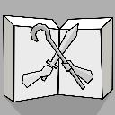
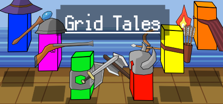

## Grid Tales

A game develop by by Hang Zhang.

## Technical support

### Contact us

 If you have any questions, please contact us by this email and we give reply to you as soon as possible.

1. E-mail: <abczhanghang@gmail.com>
2. E-mail: <909715631@qq.com>
3. Bilibil Social sites: [zhang阿hang](https://space.bilibili.com/245750180)  
<!-- 4. Join QQ group: [103729508](https://jq.qq.com/?_wv=1027&k=CHDCsepW)   -->

5. Twitter: [zhang阿hang](https://twitter.com/hangshow2011)  

### What's news
- 2021/12/17
  - Can be download On [Microsoft Store](https://www.microsoft.com/store/apps/9NBZGWPTSVL8)  now.
  - Can be download On [Xbox Live](https://www.xbox.com/en-us/games/store/grid-tales/9nbzgwptsvl8)  now.

- 2021/12/16
  - Can be download On [Google Play](https://play.google.com/store/apps/details?id=com.lehuan.GridTales)  now.

- 2021/12/15
  - Can be download On [Steam](https://store.steampowered.com/app/1739940/Grid_Tales/)  now.

- 2021/12/14
  - Can be download On [App Store](https://apps.apple.com/app/id1597284793)  now.

- 2021/12/12
  - Game pad  are now supported.

<!-- For more details see [Basic writing and formatting syntax](https://docs.github.com/en/github/writing-on-github/getting-started-with-writing-and-formatting-on-github/basic-writing-and-formatting-syntax). -->
### Privacy Policy
go to [Privacy Policy](./policy.md).

<!-- ### Support or Contact

Having trouble with Pages? Check out our [documentation](https://docs.github.com/categories/github-pages-basics/) or [contact support](https://support.github.com/contact) and we’ll help you sort it out. -->
